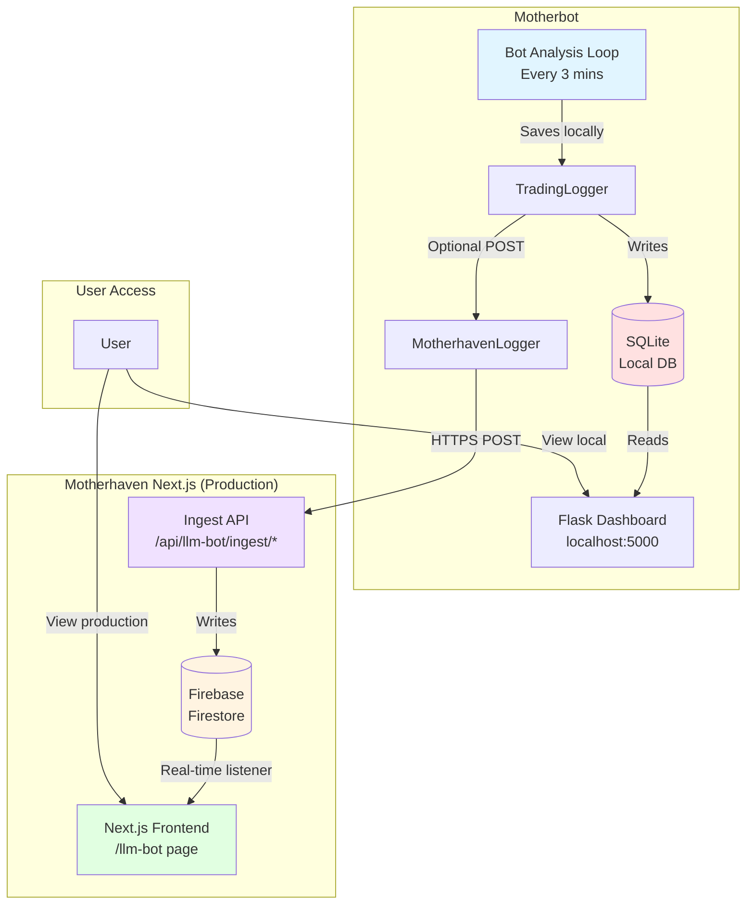
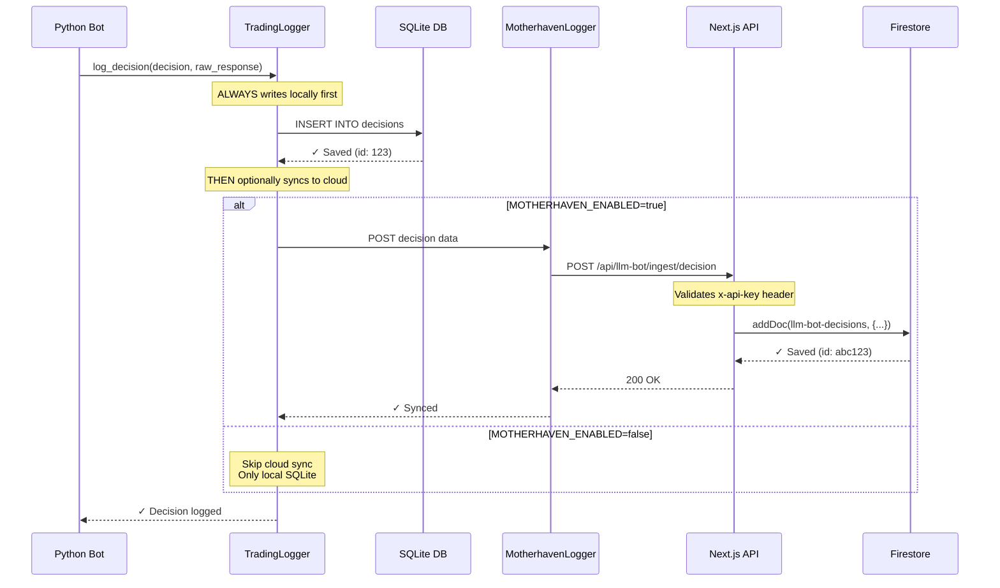
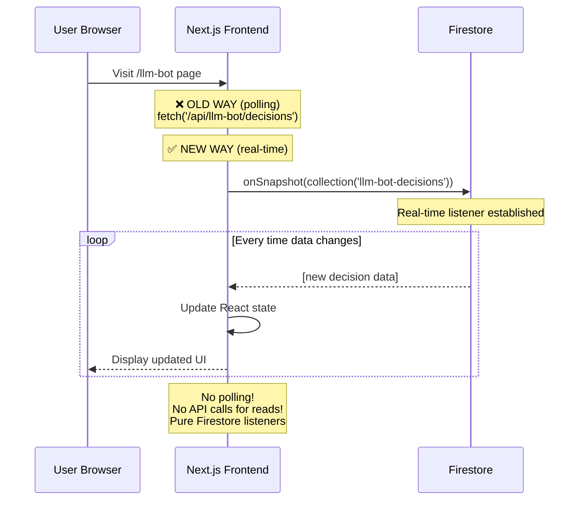
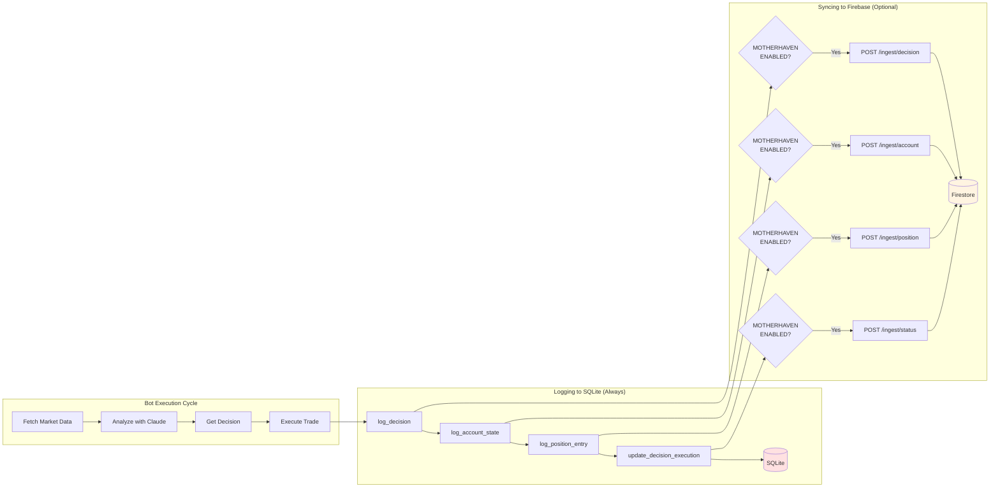
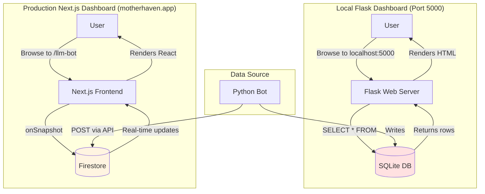
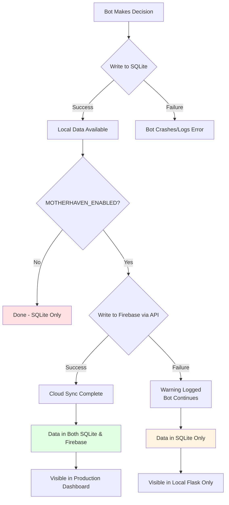

# Motherbot Data Flow Architecture

## Complete System Architecture



---

## Detailed Data Flow by Operation

### 1. Bot Makes a Trading Decision



---

### 2. Frontend Displays Data



---

### 3. Complete Write Flow (Bot → Firebase)



---

### 4. Read Flows (Two Interfaces)



---

## API Endpoint Purposes

### ❌ WRONG: Frontend Polling API for Reads

```typescript
// ❌ DON'T DO THIS
const { decisions, loading } = useBotDecisions(); // Polls /api/llm-bot/decisions

useEffect(() => {
  const interval = setInterval(() => {
    fetch('/api/llm-bot/decisions'); // ❌ Hitting API every 10s
  }, 10000);
}, []);
```

### ✅ CORRECT: Frontend Using Firestore Listeners

```typescript
// ✅ DO THIS
import { db } from "@/firebase";
import { collection, onSnapshot, query, orderBy, limit } from "firebase/firestore";

const [decisions, setDecisions] = useState([]);

useEffect(() => {
  const q = query(
    collection(db, "llm-bot-decisions"),
    orderBy("timestamp", "desc"),
    limit(50)
  );

  // Real-time listener - no polling!
  const unsubscribe = onSnapshot(q, (snapshot) => {
    const data = snapshot.docs.map(doc => ({ id: doc.id, ...doc.data() }));
    setDecisions(data);
  });

  return () => unsubscribe(); // Cleanup
}, []);
```

---

## API Endpoints Table

| Endpoint | Method | Purpose | Who Calls It | Returns |
|----------|--------|---------|--------------|---------|
| `/api/llm-bot/ingest/decision` | POST | Write decision to Firebase | **Bot only** | `{ success: true }` |
| `/api/llm-bot/ingest/account` | POST | Write account state to Firebase | **Bot only** | `{ success: true }` |
| `/api/llm-bot/ingest/position` | POST | Write position to Firebase | **Bot only** | `{ success: true }` |
| `/api/llm-bot/ingest/status` | POST | Write status to Firebase | **Bot only** | `{ success: true }` |
| `/api/llm-bot/decisions` | GET | ❌ **DEPRECATED** - Use Firestore | ~~Frontend~~ | Decision array |
| `/api/llm-bot/positions` | GET | ❌ **DEPRECATED** - Use Firestore | ~~Frontend~~ | Position array |
| `/api/llm-bot/account` | GET | ❌ **DEPRECATED** - Use Firestore | ~~Frontend~~ | Account object |
| `/api/llm-bot/status` | GET | ❌ **DEPRECATED** - Use Firestore | ~~Frontend~~ | Status object |

**Note:** The GET endpoints can be removed once frontend switches to Firestore listeners.

---

## Firebase Collections Structure

```
firestore
├── llm-bot-decisions/
│   ├── {docId}/
│   │   ├── timestamp: "2025-11-29T12:00:00Z"
│   │   ├── coin: "BTC/USDC:USDC"
│   │   ├── signal: "buy_to_enter"
│   │   ├── execution_status: "failed"
│   │   ├── execution_error: "Insufficient balance"
│   │   └── ...
│
├── llm-bot-positions/
│   ├── {docId}/
│   │   ├── position_id: "BTC_20251129_120000"
│   │   ├── coin: "BTC/USDC:USDC"
│   │   ├── status: "open"
│   │   └── ...
│
├── llm-bot-account/
│   ├── {docId}/
│   │   ├── timestamp: "2025-11-29T12:00:00Z"
│   │   ├── balance_usd: 29.06
│   │   ├── equity_usd: 29.06
│   │   └── ...
│
└── llm-bot-status/
    ├── {docId}/
        ├── timestamp: "2025-11-29T12:00:00Z"
        ├── status: "running"
        ├── message: "Executed hold for BTC/USDC:USDC"
        └── ...
```

---

## Data Consistency Model



**Key Points:**
1. **SQLite is the source of truth** for the bot
2. **Firebase is optional sync** - bot continues if sync fails
3. **No bidirectional sync** - changes in Firebase don't flow back to SQLite
4. **Local Flask reads SQLite** (always accurate)
5. **Production Next.js reads Firebase** (may lag if sync fails)

---

## Summary

### ✅ Correct Architecture

**Bot (Python):**
- ✅ Writes to SQLite (always)
- ✅ POSTs to `/api/llm-bot/ingest/*` (when enabled)
- ✅ Flask reads from SQLite (local dashboard)

**API (Next.js):**
- ✅ Receives POSTs from bot
- ✅ Writes to Firestore
- ❌ ~~Should NOT serve reads to frontend~~

**Frontend (Next.js):**
- ✅ Uses Firestore listeners (real-time)
- ❌ ~~Should NOT poll API endpoints~~

### 🔧 What Needs to Change

1. **Replace all `useBotDecisions`, `useBotPositions`, etc. hooks** with Firestore listeners
2. **Remove GET endpoints** from `/api/llm-bot/*` (or deprecate)
3. **Update frontend components** to use `onSnapshot` instead of `fetch`

---

## Migration Checklist

- [x] Replace `useBotDecisions` with Firestore listener
- [x] Replace `useBotPositions` with Firestore listener
- [x] Replace `useBotAccount` with Firestore listener
- [x] Replace `useBotStatus` with Firestore listener
- [x] Replace `useBotErrors` with Firestore listener
- [x] Test real-time updates
- [ ] Remove deprecated API GET endpoints (optional cleanup)
- [x] Update documentation

✅ **Migration Complete!** All hooks now use Firebase real-time listeners instead of polling.

